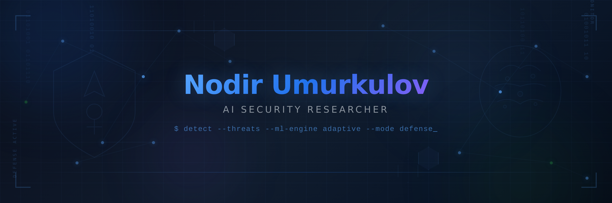
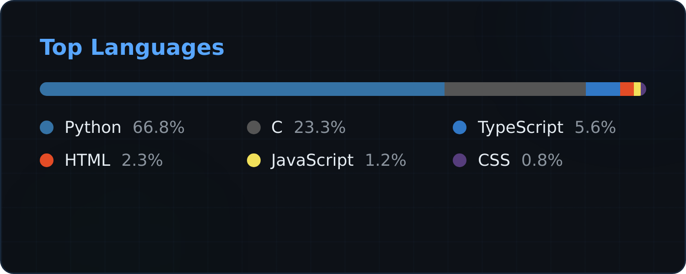
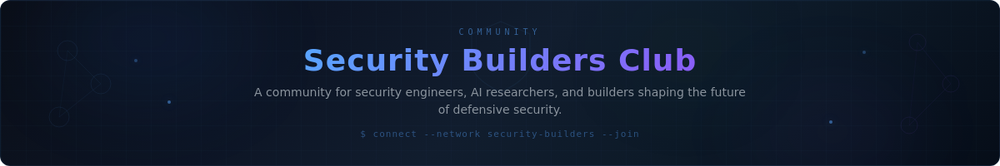

<p align="center">
  
</p>

<div align="center">

[](https://git.io/typing-svg)

</div>

<p align="center">
  
</p>

### `> whoami`

```python
class SecurityResearcher:
    def __init__(self):
        self.name     = "Nodir Umurkulov"
        self.role     = "AI Security Researcher"
        self.domains  = ["Threat Intelligence", "V2X/V2V Security",
                         "Adversarial ML", "AuthN/AuthZ", "Malware Analysis"]
        self.approach = "offense informs defense"

    def current_focus(self):
        return [
            "ML-driven behavioural anomaly detection for connected vehicles",
            "Securing AI pipelines against adversarial attacks",
            "Sandbox & virtualisation artifact hardening",
            "Building threat intel fusion platforms",
        ]
```

<p align="center">
  
</p>

### 🛡️ Security Arsenal

<div align="center">

**Threat Intelligence & Analysis**


**AI / ML Security**


**AI Safety & Alignment**


**AI Security Research**


**Cloud & Infrastructure Security**


**Application Security**


**Security Operations & Compliance**


**Languages & Frameworks**


**Offensive / Defensive Tooling**


</div>

<p align="center">
  
</p>

### 🔬 Featured Research & Projects

<div align="center">
<table>
<tr>
<td width="50%" valign="top">

#### [`Argus`](https://github.com/nodirumurkulov/Argus)
> **AI-Powered Security Intelligence**
>
> Intelligent security monitoring and threat detection platform leveraging ML for real-time analysis.
>
> `Python` `Machine Learning` `Threat Detection`

</td>
<td width="50%" valign="top">

#### [`V2X Security Intelligence`](https://github.com/nodirumurkulov/V2X-Security-Intelligence-Platform)
> **Vehicle-to-Everything Security Platform**
>
> Securing connected vehicle ecosystems against adversarial attacks on V2X communication channels.
>
> `Python` `V2X` `Connected Vehicles`

</td>
</tr>
<tr>
<td width="50%" valign="top">

#### [`V2V Behavioural Verification`](https://github.com/nodirumurkulov/v2v_security)
> **ML-Powered Attack Detection Layer**
>
> Detects attacks bypassing cryptographic auth through behavioural analysis, correlation, and ML.
>
> `Python` `Anomaly Detection` `V2V`

</td>
<td width="50%" valign="top">

#### [`Sandbox Artifact Detector`](https://github.com/nodirumurkulov/sandbox-artifact-detector)
> **Defensive Virtualisation Research**
>
> Windows-first tool for detecting virtualisation & sandbox artifacts, measuring environment exposure.
>
> `C` `Reverse Engineering` `Sandbox Detection`

</td>
</tr>
<tr>
<td width="50%" valign="top">

#### [`Threat Intel Fusion`](https://github.com/nodirumurkulov/Threat-Intel-Fusion-Platform)
> **Multi-Source Intelligence Correlation**
>
> Aggregates and correlates threat data from multiple feeds into actionable intelligence.
>
> `Python` `Threat Intelligence` `OSINT`

</td>
<td width="50%" valign="top">

#### [`AuthN/AuthZ Security`](https://github.com/nodirumurkulov/authn-authz-security)
> **Authentication & Authorization Hardening**
>
> Secure-by-default auth patterns with RLS, RBAC, and zero-trust principles.
>
> `TypeScript` `Security` `Zero Trust`

</td>
</tr>
</table>
</div>

<p align="center">
  
</p>

### 📊 GitHub Analytics

<div align="center">
  
</div>

<br/>

<div align="center">
  
</div>

<p align="center">
  
</p>

### 📈 Contribution Graph

[](https://github.com/nodirumurkulov)

<p align="center">
  
</p>

### 🏆 CTF & Certifications

<div align="center">


</div>

<p align="center">
  
</p>

### 🌐 Community

<div align="center">

<a href="https://www.linkedin.com/company/116003481/">
  
</a>

<br/>

[](https://www.linkedin.com/company/116003481/)

</div>

<p align="center">
  
</p>

<div align="center">

### `> netstat -an | grep LISTENING`

[](mailto:nodirumurkulov128@gmail.com)
[](https://github.com/nodirumurkulov)

</div>

<div align="center">


</div>

<p align="center">
  
</p>
